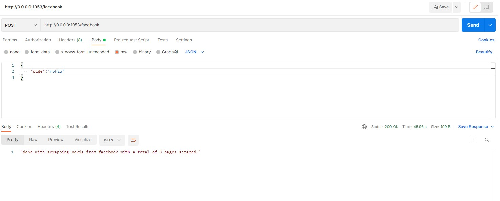
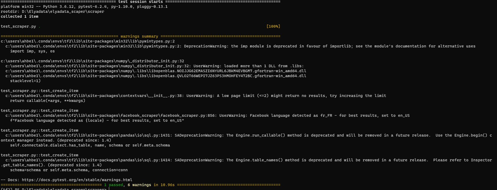
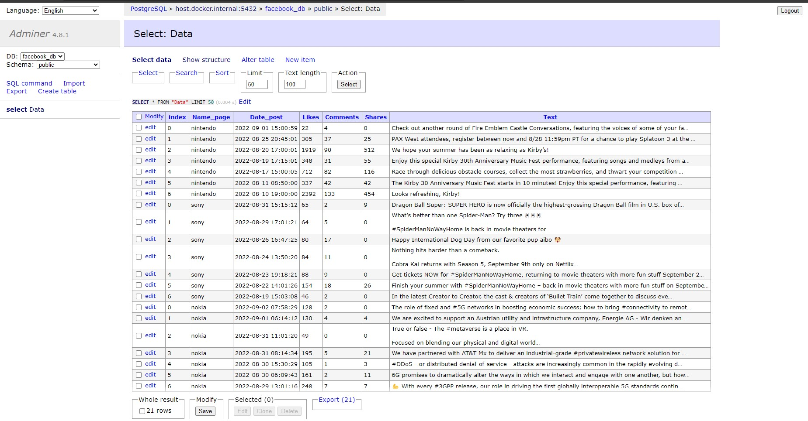

<h1 align="center">Welcome to Elyadata_scraper 👋</h1>
<p>
  
  <a href="test" target="_blank">
    
  </a>
  <a href="https://twitter.com/abhd96" target="_blank">
    
  </a>
</p>

> This a repository for the testing phase of Elyadata. It is an api to scrape public pages from facebook and save the data into a postgres database. 

## Install
To deploy the API we use docker-compose:
```sh
docker-compose -f stack.yml up -d
```


## Usage
Use postman to send requests to the API.
Request body:
```sh
{
  "page": name of the page,
  "number_pages": number of pages to scrape

}
```


## Run tests
For running FastAPI test:
```sh
pytest
```


## DataBase
We use Postgres as our database for this project:



The schema for the Database is defined at _init.sql_
## Author

👤 **Ahmed Belarbi**

* Twitter: [@abhd96](https://twitter.com/abhd96)
* Github: [@ahbe](https://github.com/ahbe)
* LinkedIn: [@ahmedbelarbi96](https://linkedin.com/in/ahmedbelarbi96)

## Show your support

Give a ⭐️ if you liked this project!

***